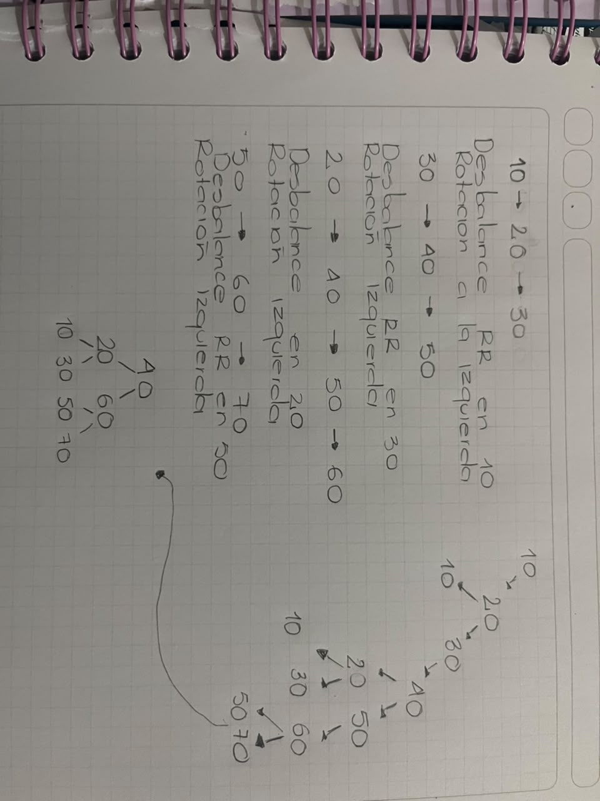

# -Sistema-de-Gesti-n-de-Atenci-n-Estudiantil
## 2. Descripción de la solución
El sistema permite registrar, buscar y eliminar estudiantes, organizar sus turnos de atención y consultar información mediante diferentes estructuras de datos.

## 3. Clases y estructuras de datos

- `Estudiante`: almacena los datos del estudiante.
- `ListaEstudiantes`: lista enlazada para registrar, buscar y eliminar estudiantes.
- `ColaLista`: cola enlazada para organizar los turnos.
- `ColaArreglo`: cola implementada mediante un arreglo.
- `ArbolBinarioBusqueda`: árbol para buscar estudiantes por código.
- `Grafo`: representa las conexiones entre los servicios de la institución.
  
 ## 4. Justificación técnica

Se utiliza una lista enlazada para manejar los estudiantes, porque permite agregar y eliminar registros sin desplazar los demás elementos.
La cola permite atender a los estudiantes en el orden en que llegan. El árbol binario facilita la búsqueda por código y el grafo permite representar las conexiones entre los servicios.

## 5. Comparación de las colas

La cola con arreglo tiene una capacidad fija, mientras que la cola enlazada puede crecer según sea necesario.
Ambas utilizan las mismas operaciones: encolar, desencolar, verificar si está vacía y mostrar los turnos.

## 6. Prueba de altura del árbol

Se probaron 15 claves en dos órdenes diferentes:
- Orden desordenado: altura = 4.
- Orden ascendente: altura = 15.
Al insertar las claves de menor a mayor, el árbol se vuelve más inclinado y las búsquedas pueden requerir más comparaciones.

## 8. Limitaciones y mejoras

El sistema funciona en memoria y la cola con arreglo tiene una capacidad limitada.
Como mejoras se podría implementar una cola circular, un árbol AVL para mantener el árbol equilibrado y una base de datos para guardar la información de forma permanente.

## 9. Instrucciones para ejecutar el programa
1. Tener instalado Python 3.
2. Descargar o clonar el repositorio.
3. Abrir el archivo del programa.
4. Ejecutarlo desde Python.
El programa mostrará en la consola las pruebas y resultados de las estructuras de datos.

## Árbol AVL

A continuación se muestra el árbol AVL realizado a mano:

)
